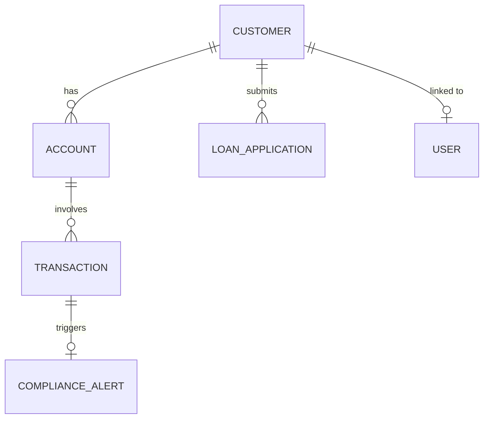

# 🏦 Core Banking in a Box

A containerized, demo-ready core banking system optimized for showcasing MuleSoft integrations with Salesforce Financial Services Cloud.

## 🚀 Quick Start

### One Command Deployment

```bash
# Clone and run
git clone <repo-url> core-banking-demo
cd core-banking-demo
docker build -t core-banking-demo .
docker run -p 3000:3000 -p 3001:3001 core-banking-demo

# System ready at:
# Banking Web UI: http://localhost:3000
# Banking API: http://localhost:3001/api/v1
# API Documentation: http://localhost:3001/docs
# Health Check: http://localhost:3001/health
```

### Local Development Setup

```bash
# Install dependencies
npm install
cd frontend && npm install && cd ..

# Initialize database
npm run init:db

# Seed demo data
npm run seed:data

# Start development servers
npm run dev
```

## 📋 Features

### Core Banking Modules
- ✅ **Customer Management** - KYC, customer profiles, relationships
- ✅ **Account Management** - Multiple account types, balance tracking
- ✅ **Transaction Processing** - Deposits, withdrawals, transfers, payments
- ✅ **Loan Origination** - Application submission, underwriting workflow
- ✅ **Compliance Monitoring** - AML alerts, OFAC screening, regulatory reporting

### Integration Ready
- 🔌 **MuleSoft Compatible** - RESTful APIs with OpenAPI 3.0 specification
- ☁️ **Salesforce FSC Ready** - Data models aligned with Financial Services Cloud
- 🔔 **Webhook Support** - Real-time event notifications
- 📊 **Integration Monitoring** - Track all API activity

### Demo Features
- 📦 **Pre-loaded Data** - 50+ customers, 200+ accounts, 1000+ transactions
- 🎬 **Demo Scenarios** - One-click demonstrations of key workflows
- 🔄 **Reset Capability** - Instant return to clean demo state
- 📈 **Performance Metrics** - Real-time system monitoring

## 🔑 API Authentication

### Default Credentials

**Admin User:**
- Username: `admin`
- Password: `admin123`

**Demo Customer Users:**
- Username: `john.smith0`
- Password: `demo123`

### Authentication Methods

1. **JWT Token** (Recommended)
```bash
# Login to get token
curl -X POST http://localhost:3001/api/v1/auth/login \
  -H "Content-Type: application/json" \
  -d '{"username":"admin","password":"admin123"}'

# Use token in requests
curl http://localhost:3001/api/v1/customers \
  -H "Authorization: Bearer <your-token>"
```

2. **API Key** (For integrations)
```bash
curl http://localhost:3001/api/v1/customers \
  -H "X-API-Key: demo-api-key"
```

## 📚 API Endpoints

### Core Endpoints

| Endpoint | Method | Description |
|----------|--------|-------------|
| `/api/v1/auth/login` | POST | Authenticate and get JWT token |
| `/api/v1/customers` | POST | Create new customer |
| `/api/v1/customers/{id}` | GET | Get customer profile |
| `/api/v1/accounts` | POST | Open new account |
| `/api/v1/accounts/{id}` | GET | Get account details |
| `/api/v1/transactions` | POST | Process transaction |
| `/api/v1/loans/applications` | POST | Submit loan application |
| `/api/v1/compliance/alerts` | GET | Get compliance alerts |

### Integration Endpoints

| Endpoint | Method | Description |
|----------|--------|-------------|
| `/api/v1/webhooks/mulesoft` | POST | MuleSoft webhook receiver |
| `/api/v1/webhooks/salesforce` | POST | Salesforce webhook receiver |
| `/api/v1/demo/reset` | POST | Reset demo data |
| `/api/v1/demo/scenario/{name}` | POST | Trigger demo scenario |

## 🎭 Demo Scenarios

### 1. Customer Onboarding
```bash
curl -X POST http://localhost:3001/api/v1/demo/scenario/customer-onboarding \
  -H "X-API-Key: demo-api-key"
```

### 2. Loan Application
```bash
curl -X POST http://localhost:3001/api/v1/demo/scenario/loan-origination \
  -H "X-API-Key: demo-api-key"
```

### 3. Compliance Alert
```bash
curl -X POST http://localhost:3001/api/v1/demo/scenario/compliance-alert \
  -H "X-API-Key: demo-api-key"
```

### 4. Fraud Detection
```bash
curl -X POST http://localhost:3001/api/v1/demo/scenario/fraud-detection \
  -H "X-API-Key: demo-api-key"
```

## 🔧 MuleSoft Integration

### Sample Mule Flow

```xml
<flow name="sync-customer-to-salesforce">
  <http:listener path="/banking/customer-created" method="POST"/>
  
  <!-- Get customer from banking system -->
  <http:request method="GET" 
    path="/api/v1/customers/{customerId}"
    config-ref="BankingAPI">
    <http:headers>
      <http:header key="X-API-Key" value="${banking.api.key}"/>
    </http:headers>
  </http:request>
  
  <!-- Transform to Salesforce format -->
  <ee:transform>
    <ee:message>
      <ee:set-payload><![CDATA[%dw 2.0
        output application/json
        ---
        {
          Name: payload.firstName ++ " " ++ payload.lastName,
          PersonEmail: payload.email,
          Phone: payload.phone,
          BillingCity: payload.city,
          BillingState: payload.state,
          AnnualRevenue: payload.annualIncome
        }
      ]]></ee:set-payload>
    </ee:message>
  </ee:transform>
  
  <!-- Create in Salesforce -->
  <salesforce:create type="Account" config-ref="Salesforce"/>
</flow>
```

### Webhook Configuration

Configure MuleSoft to send events to:
```
http://localhost:3001/api/v1/webhooks/mulesoft
```

## 🏗️ Architecture

### Technology Stack
- **Backend**: Node.js with Express.js
- **Database**: SQLite with WAL mode
- **Authentication**: JWT tokens
- **Documentation**: Swagger/OpenAPI 3.0
- **Container**: Docker Alpine Linux

### Data Model



## 🧪 Testing

### Run Tests
```bash
# Backend tests
npm run test:backend

# API tests
npm run test:api

# Load tests
npm run test:load
```

### Manual Testing

1. **Create a customer:**
```bash
curl -X POST http://localhost:3001/api/v1/customers \
  -H "Content-Type: application/json" \
  -H "X-API-Key: demo-api-key" \
  -d '{
    "customerType": "INDIVIDUAL",
    "firstName": "Test",
    "lastName": "User",
    "email": "test@example.com",
    "phone": "555-0100"
  }'
```

2. **Open an account:**
```bash
curl -X POST http://localhost:3001/api/v1/accounts \
  -H "Content-Type: application/json" \
  -H "X-API-Key: demo-api-key" \
  -d '{
    "customerId": "<customer-id>",
    "accountType": "CHECKING",
    "productName": "Premium Checking",
    "initialDeposit": 1000
  }'
```

3. **Process a transaction:**
```bash
curl -X POST http://localhost:3001/api/v1/transactions \
  -H "Content-Type: application/json" \
  -H "X-API-Key: demo-api-key" \
  -d '{
    "fromAccountId": "<account-id>",
    "toAccountId": "<account-id>",
    "amount": 100,
    "transactionType": "TRANSFER",
    "description": "Test transfer"
  }'
```

## 🔍 Monitoring

### Health Check
```bash
curl http://localhost:3001/health
```

### System Status
```bash
curl http://localhost:3001/status
```

### Integration Logs
```bash
curl http://localhost:3001/api/v1/integration/logs \
  -H "X-API-Key: demo-api-key"
```

## 📊 Demo Data Summary

The system comes pre-loaded with:
- **50 Customers** - Mix of individual and business customers
- **150+ Accounts** - Checking, savings, loans, credit cards
- **1000+ Transactions** - Various types with realistic patterns
- **20 Loan Applications** - In different stages of processing
- **15+ Compliance Alerts** - AML, fraud, and regulatory alerts

## 🔒 Security Features

- JWT-based authentication
- Role-based access control (RBAC)
- API rate limiting
- Request validation
- SQL injection prevention
- XSS protection
- Audit logging

## 🚦 Environment Variables

```bash
# API Configuration
API_PORT=3001
UI_PORT=3000

# Database
DB_PATH=./banking-demo.db

# Security
JWT_SECRET=your-secret-key
API_KEY=your-api-key
ADMIN_PASSWORD=admin123

# Integration
SALESFORCE_WEBHOOK_URL=http://your-salesforce-webhook
MULESOFT_WEBHOOK_URL=http://your-mulesoft-webhook

# Demo Mode
DEMO_MODE=true
LOG_LEVEL=info
```

## 📝 License

This is a demonstration system for MuleSoft and Salesforce Financial Services Cloud integration showcases.

## 🤝 Support

For issues or questions:
- Create an issue in the repository
- Contact the development team
- Check the API documentation at `/docs`

## 🎯 Next Steps

1. **Deploy to Cloud**: Deploy to AWS, Azure, or GCP
2. **Configure MuleSoft**: Set up Anypoint connectors
3. **Connect Salesforce**: Configure FSC integration
4. **Run Demo Scenarios**: Test integration flows
5. **Customize Data**: Add your own demo scenarios

---

Built with ❤️ for Financial Services demonstrations